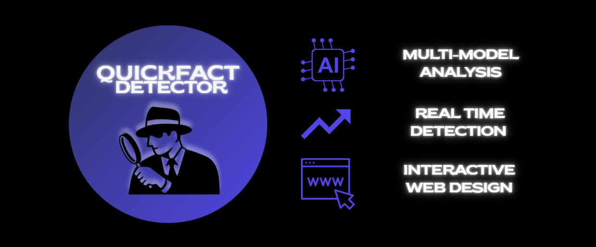
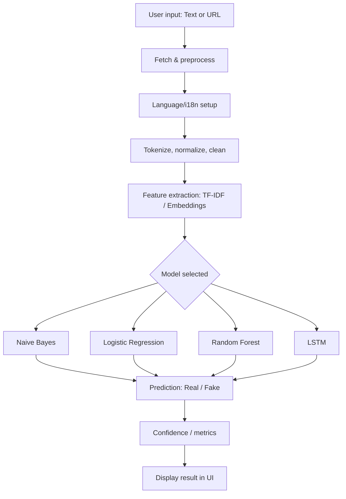

<h1 align = "center">
   
</h1>

## 🚀 Live Demo
**Try it now 🔗:** [Go Live](https://quickfactchecker01.onrender.com/)


## 📌 Project Overview
QuickFactChecker is a 🧠 **machine learning–based web app** that helps detect whether a 📰 news article is **real** or **fake**.
It uses different models (e.g., Naive Bayes, LSTM 🧠) trained on the **LIAR dataset** 📚 to evaluate credibility and assist users in identifying potentially misleading information.


## 🌍 Vision

Build a more informed internet by making fact‑checking fast, accessible, and trustworthy for everyone.


## 🎯 Mission

- ⚡ Speed: deliver quick, reliable fake‑vs‑real assessments
- 🔎 Clarity: present results with confidence and clear cues
- 🧠 Learning: support multiple models and continuous improvement
- 🌐 Access: keep the app simple to use across devices


## 🤔 Why QuickFactChecker?

- 🧭 One‑place check: paste text or URL and get a verdict fast
- 🧮 Multiple models: Naive Bayes, Logistic Regression, Random Forest, LSTM
- 📊 Transparent output: result + confidence to judge reliability


## 🧭 Project Flowchart


```mermaid
flowchart TD
   A[User input: Text or URL] --> B[Fetch & preprocess]
   B --> C[Language/i18n setup]
   C --> D[Tokenize, normalize, clean]
   D --> E[Feature extraction: TF-IDF / Embeddings]
   E --> F{Model selected}
   F --> F1[Naive Bayes]
   F --> F2[Logistic Regression]
   F --> F3[Random Forest]
   F --> F4[LSTM]
   F1 --> G[Prediction: Real / Fake]
   F2 --> G
   F3 --> G
   F4 --> G
   G --> H[Confidence / metrics]
   H --> I[Display result in UI]
```


## 🌟GSSoC 

🌟 **Exciting News...**

🚀 This project is now an official part of GirlScript Summer of Code – GSSoC'25! 💻 We're thrilled to welcome contributors from all over India and beyond to collaborate, build, and grow *QuickFactChecker!* Let’s make learning and career development smarter – together! 🌟

👩‍💻 GSSoC is one of India’s **largest 3-month-long open-source programs** that encourages developers of all levels to contribute to real-world projects 🌍 while learning, collaborating, and growing together. 🌱

🌈 With **mentorship, community support**, and **collaborative coding**, it's the perfect platform for developers to:

- ✨ Improve their skills
- 🤝 Contribute to impactful projects
- 🏆 Get recognized for their work
- 📜 Receive certificates and swag!

🎉 **I can’t wait to welcome new contributors** from GSSoC 2025 to this QuickFactChecker project family! Let's build, learn, and grow together — one commit at a time. 🔥


## ✨ Features
- ✅ Fake news classification using ML models (**Naive Bayes**, **Logistic Regression**, **Random Forest**, and **LSTM**).
- ✅ Interactive web app built with **Flask** and **HTML templates** 🧪🖥️.
- ✅ **Automated NLTK Setup** to prevent missing resource errors 🧩.
- ✅ Preprocessed dataset included (`train.tsv`, `test.tsv`, `valid.tsv`) 🗂️.
- ✅ Notebooks for **data analysis & experimentation** (`liar-data-analysis.ipynb`, `dataset.ipynb`) 📓📈.
- ✅ Easy setup with `requirements.txt` ⚙️.


## 📂 Project Structure

```
QuickFactChecker/
├── .github/                              # GitHub-related configurations
│   ├── ISSUE_TEMPLATE/                   # Templates for creating GitHub issues
│   ├── workflows/                        # GitHub Actions workflows (CI/CD automation)
│   └── pull_request_template.md          # Template for new pull requests
│
├── .venv/                                # Virtual environment for Python dependencies
│   └── Lib/site-packages/                # Installed Python packages
│
├── Public/                               # Public assets (frontend files)
│   ├── css/                              # Stylesheets
│   ├── js/                               # JavaScript files
│   ├── locales/                          # Language translation files (i18n support)
│   ├── index.html                        # Main HTML file
│   ├── index_i18n.html                   # Multilingual HTML file
│   ├── script.js                         # Main frontend script
│   └── style.css                         # Main stylesheet
│
├── app.py                                # Flask application entry point
├── install_i18n.py                       # Script to set up internationalization (i18n)
│
├── module/                               # Custom Python modules
│
├── dataset/                              # Datasets and analysis notebooks
│   ├── liar/                             # LIAR dataset folder
│   ├── dataset.ipynb                     # General dataset exploration notebook
│   ├── fake-news-detection-ml-comparison.ipynb  # Comparison of ML models
│   ├── fake-news-detection-using-lr.ipynb       # Logistic Regression implementation
│   ├── fake-news-detection-using-lstm.ipynb     # LSTM model notebook
│   ├── fake-news-detection-using-nb.ipynb       # Naive Bayes model notebook
│   ├── fake-news-detection-using-svm.ipynb      # SVM model notebook
│   ├── fake-news-detection-using-xgboost.ipynb  # XGBoost model notebook
│   └── liar-data-analysis.ipynb                 # Data analysis for LIAR dataset
│
├── results/                             # Folder for storing results, graphs, and metrics
│
├── scripts/                             # Additional scripts used in the project
│
├── tests/                               # Unit and integration tests
│   ├── test_app.py                      # Tests for main app
│   ├── tests_app.py                     # Additional test scripts
│   └── tests_dummy.py                   # Dummy test file
│
├── utils/                               # Utility modules
│   └── fetch_url.py                     # Helper function to fetch and preprocess URLs
│
├── CODE_OF_CONDUCT.md                   # Community guidelines
├── CONTRIBUTING.md                      # Contribution guidelines
├── LICENSE                              # License information
├── LOGO.svg                             # Project logo
├── GSSoC.png                            # GSSoC banner image
├── MULTILINGUAL_SUPPORT.md              # Guide for adding multiple language support
├── Readme.md                            # Main project documentation
├── debug.log                            # Debugging log file
├── .env                                 # Environment variables
├── .gitignore                           # Files to be ignored by Git
├── .gitattributes                       # Git configuration for line endings
├── .coverage                            # Code coverage report
└── files.txt                            # Miscellaneous file list

```


## ⚙️ Installation & Setup

1. 📥 Clone the repository and navigate into it:
   ```bash
   git clone https://github.com/Deepika14145/QuickFactChecker.git
   cd QuickFactChecker
   ```
2. 🧪 Create virtual environment (optional but recommended)
   ```bash
      python -m venv venv
3. ▶️ Activate the virtual environment:
   ```bash
      source venv/bin/activate   # for Linux/Mac
      venv\Scripts\activate      # for Windows
   ```

4. 📦 Install the required dependencies:
   ```bash
   pip install -r requirements.txt
   ```

5. 📚 Download NLTK Corpora:
```bash
python scripts/setup_nltk.py
```


## �️ Troubleshooting

- ⛔ NLTK resource errors: run `python scripts/setup_nltk.py` again; check internet connection
- 📦 Import errors: ensure virtualenv is active and `pip install -r requirements.txt` ran without errors
- 🌐 CORS or fetch failures for URLs: verify the target site is reachable; try plain text input
- 🧪 Notebook issues: update Jupyter and restart kernel; ensure correct interpreter (venv)
- 🔌 Port in use: stop prior app instance or use a different port


## 📊 Baseline Model Comparison

We evaluated three models on the LIAR dataset using TF-IDF features. Example results 📈 (accuracy & precision):
example:
| Model               | Accuracy | Precision |
|---------------------|----------|-----------|
| Naive Bayes         | 0.XXXX   | 0.XXXX    |
| Logistic Regression | 0.XXXX   | 0.XXXX    |
| Random Forest       | 0.XXXX   | 0.XXXX    |

Logistic Regression achieved the highest accuracy among the tested baselines.
### 🔧 Run the comparison script
To reproduce these results, run:
```bash
scripts/fake_news_logreg_rf.py
```


## ▶️ Usage

1. 🟢 Run the following command to start the application:
   ```bash
   python app.py
   ```

2. 📰 The app will provide predictions on whether a news article is real or fake based on the input.
   


## 🛠️ Model Training
To retrain or experiment with the models, run the provided Jupyter notebooks. Ensure your virtual environment is activated and all dependencies are installed.
### 🧮 Naive Bayes
Run the notebook:
 ```bash
jupyter notebook fake-news-detection-using-nb.ipynb
 ```

### 🧠 LSTM
Run the notebook:
 ```bash
jupyter notebook fake-news-detection-using-lstm.ipynb
 ```

### 📊 Dataset Analysis
```bash
jupyter notebook liar-data-analysis.ipynb
 ```


## 🤝 Contributing

Contributions are welcome! Whether you’re fixing typos, improving docs, or adding new features — every PR helps. Follow these steps:

1. 🍴 Fork the repository
2. 🌿 Create a new branch (git checkout -b feature-name)
3. 🛠️ Make your changes
4. 💬 Commit your changes (git commit -m 'description of your feature/fix')
5. ⬆️ Push to the branch  (git push origin feature-name)
6. 🔁 Create a Pull Request

Please read [CONTRIBUTING.md](CONTRIBUTING.md) and follow our [Code of Conduct](CODE_OF_CONDUCT.md).


## 📦 Deployment

The application is deployed on **Render** ☁️ and accessible at: [Go Live](https://quickfactchecker01.onrender.com/)

### Deployment Features:
- ✅ **Free hosting** on Render 💸
- ✅ **Auto-deployment** from GitHub commits 🔄
- ✅ **Production-ready** with Gunicorn server 🚀
- ✅ **HTTPS enabled** by default 🔒
- ✅ **Optimized requirements** for faster build times ⚡


### Technical Stack:
- **Backend**: Flask (Python) 🐍
- **Server**: Gunicorn 🛠️
- **Platform**: Render ☁️
- **CI/CD**: GitHub integration 🔗


## 📧 Contact  

For queries, feedback, or guidance regarding this project, you can contact the **mentor** assigned to the issue:  

- 📩 **GitHub** (Owner): [Deepika14145](https://github.com/Deepika14145)
- 💬 **By commit/PR comments**: Please tag the mentor in your commit or pull request discussion for direct feedback.  
 
Original Repository: [QuickFactChecker](https://github.com/Deepika14145/QuickFactChecker.git)  


## Contributor

A heartfelt thank you to all the contributors who have dedicated their time and effort to make this project a success.  
Your contributions—whether it’s code, design, testing, or documentation—are truly appreciated! 🚀

#### Thanks to all the wonderful contributors 💖

<a href="https://github.com/Deepika14145/QuickFactChecker/graphs/contributors">
  
</a>


<!--Line-->

<div>
  <h2 align="center"> Our Contributors</h2>
  <div align="center">
    <h3>Thank you for contributing to our repository</h3


<p align="center">
      <a href="https://github.com/Deepika14145/QuickFactChecker/graphs/contributors">
        
      </a>
    </p>
<a href="https://github.com/Deepika14145/QuickFactChecker/graphs/contributors">
  
</a>

See full list of contribution from contributor [Contributor Graph](https://github.com/Deepika14145/QuickFactChecker/graphs/contributors)


## 📄 **License**
This project is licensed under the **MIT License** - see the [LICENSE](LICENSE) file for details.


If you find this project useful, please give it a ⭐️! Your support is appreciated!

Feel free to contribute or suggest new features!🙏

